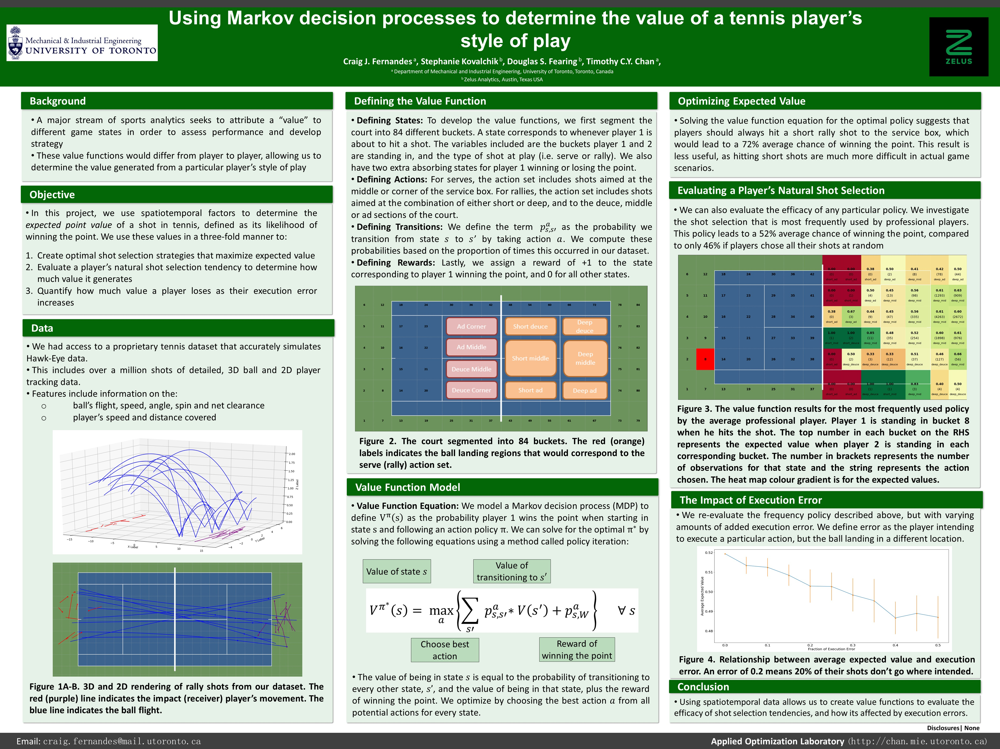

# Tennis-MDPs
Using 3-D ball and player tracking data to model tennis as a MDP and adding controllable noise to the underlying transition matrices to quantify the effect of player inaccuracies.

### Paper:

C. Fernandes, S. Kovalchik, D. S. Fearing, T. C. Y. Chan, “Using Markov decision processes to evaluate style of play in professional tennis,” In Preparation for *European Journal of Operational Research*, 2020.

### Conference Presentations

•	Canadian Operational Research Society Conference, Virtual 2021 (Oral)

•	Sport Innovation Summit, Virtual 2020 (Poster)

